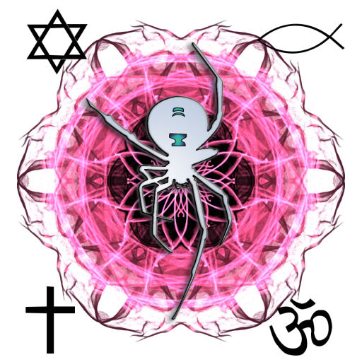
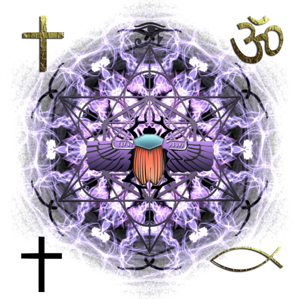

# Sacred Collection NFT Rarities

The intention behind the art of the 8 Sacred collections was for the creator to represent his love for God through a digital medium.

The number of collections, 8, was intentionally chosen to represent the infinite potential of Source. Each collection is unique and varies.

### Sacred Spiders

10,000 total to be minted.

The Sacred collections began with Sacred Spiders. Sitting in meditation on a mountain in Southern California, I was hit with divine inspiration.

"If You would have me create something. What would you have me Create?" I asked God inside my heart.

"Me." I heard. "Express your love for me through art."

This is how the design for the Sacred Spiders came into existence. I then began asking myself how I would represent God if I could.

The 5 Variations of Sacred symbols were chosen to represent God's love for us all and a Divine unity that exists between all creeds and cultures.

The probability of all 4 of the same symbols occurring in the corners is quite low. The 5 versions of 4 corner pieces also have lower probabilities. Which is the most rare?

The 7 different color variations in the backgrounds of the image represent the 7 chakras and their role in connecting us to Divine wisdom. There are 2 variances for each chakra. Does collecting all 7 have a benefit?

The sacred geometry patterns that occur within the image are a representation of the mathematical precision of the Universe. God is a magnificent programmer. As above so below. The fractal representation of the holographic universe.

The Spider. My deepest childhood fear. When deciding on the main subject I chose to represent God's love for me through my ability to overcome the most challenging spiritual battle. Fear.

The spider also represented a traumatic childhood memory that was pivotal in realizing God's love for me and ultimately my trust in Him.

The hourglass is representative of our limited belief in time. The infinite potential of the moment is exposed as we slow down and become present and aware.

### Sacred Scarabs

5,000 total to be minted.

The Sacred Scarabs NFTs added additional variances and reduced total number to be minted.

5 Sacred Symbols in black and 4 Gold Sacred Symbols now have a chance of appearing in the corners. The chances of 4 corner all black and 4 corner all gold sacred symbols occurring is further reduced as a result.

A new Eye of Horus variant layer was added. This is a representation of God's ever watchful eye over us. He is always with us. Whether we choose to acknowledge Him/Her/It or not is up to us. As I choose acknowledgement, life becomes much more simple and fulfilling.

Metatron's Cube variant was also added in 5 different color variances.

The Scarab main subject has 3 layers of variance with 7 different colors for each layer. The chance of a Scarab having all three colors on their shell is quite low as well.
